<h1 align="center">:wave: Hello there! I'm João Victor</h1>

I'm a DevOps Engineer focused on building scalable, reliable, and automated systems. Experienced with containerization, CI/CD pipelines, and Linux-based environments, with a strong interest in improving deployment efficiency and system stability.

Driven by continuous improvement, I focus on creating streamlined workflows, reducing manual processes, and ensuring consistent and maintainable infrastructure.

- :seedling: &nbsp;I’m currently learning **Terraform**

- :speech_balloon: &nbsp;I like to talk about **Cloud** and **Infrastructure**

- :zap: &nbsp;I'm automating something now!

 

> “We can only see a short distance ahead, but we can see plenty there that needs to be done.”
**— Alan Turing**

### :globe_with_meridians: Connect with me!

### :hammer_and_wrench: Tech Stack

<table align="center">
  <tr>
    <td align="center" width="96">
      
       Python
    </td>
    <td align="center" width="96">
      
       Docker
    </td>
    <td align="center" width="96">
      
       AWS
    </td>
    <td align="center" width="96">
      
       Kubernetes
    </td>
    <td align="center" width="96">
      
       Jenkins
    </td>
    <td align="center" width="96">
      
       GitHub Actions
    </td>
    <td align="center"  width="96">
      
       Terraform
    </td>
    <td align="center" width="96">
      
       Ansible
    </td>
  </tr>
</table>

### :gear: GitHub Analytics

  &nbsp;
  

