<h1 align="center">:wave: Hello there! I'm João Victor</h1>

<picture>
  <source srcset="profile/dark-stats.svg" media="(prefers-color-scheme: dark)" />
  <source srcset="profile/light-stats.svg" media="(prefers-color-scheme: light)" />
  
</picture>

- :computer: &nbsp;I'm a **Database Administrator (DBA)**
- :office: &nbsp;I'm working at **[Myself]**
- :seedling: &nbsp;I’m currently learning **Terraform**
- :book: &nbsp;Know about my experiences on my **[Resume]**
- :speech_balloon: &nbsp;I like to talk about **Database** and **Infrastructure**
- :mailbox: &nbsp;Ask me anything on my **[Issues page]**
- :zap: &nbsp;I'm automating something now!

 

### :globe_with_meridians: Connect with me!

### :hammer_and_wrench: Tech Stack

<table align="center">
  <tr>
    <td align="center" width="96">
      
       PostgreSQL
    </td>
    <td align="center" width="96">
      
       MySQL
    </td>
    <td align="center" width="96">
      
       SQL Server
    </td>
    <td align="center" width="96">
      
       Azure SQL
    </td>
    <td align="center" width="96">
      
       MongoDB
    </td>
    <td align="center" width="96">
      
       RedisDB
    </td>
    <td align="center"  width="96">
      
       DynamoDB
    </td>
    <td align="center" width="96">
      
       Ansible
    </td>
  </tr>
</table>

<!-- Links -->

[Myself]: https://github.com/onlytesting-user/Readme_Code
[Issues page]: https://github.com/onlytesting-user/Readme_Code/issues
[Resume]: https://github.com/onlytesting-user/linkedin-background
